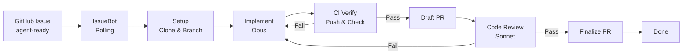
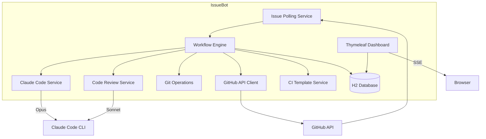

# IssueBot


An autonomous dev agent that watches GitHub repositories for issues labeled `agent-ready`, implements them using Claude Code CLI (Opus), runs independent code review (Sonnet), and delivers pull requests.

## How It Works

IssueBot is a locally-running agent that automates software development tasks end-to-end. It monitors your configured GitHub repositories, picks up labeled issues, and drives them through a structured 6-phase workflow with dual-model architecture: **Opus** writes the code, **Sonnet** reviews it independently.



### The 6-Phase Pipeline

| Phase | What Happens | Model |
|-------|-------------|-------|
| **1. Setup** | Clone repo, create feature branch, generate CI workflow if needed | - |
| **2. Implementation** | Claude Code CLI writes code based on issue spec | Opus |
| **3. CI Verification** | Commit, push, poll GitHub Actions for compile + test | - |
| **4. Draft PR** | Create draft pull request on GitHub | - |
| **5. Independent Review** | Separate model reviews code against spec, posts PR comments | Sonnet |
| **6. Completion** | Mark PR ready, auto-merge if configured, update labels | - |

If CI or review fails, IssueBot loops back to implementation with enhanced context (failure logs, review findings) and tries again up to the configured max iterations.

## Key Features

- **Dual-Model Architecture** - Opus (implementation) + Sonnet (independent review) for checks and balances
- **6-Phase Workflow** - Setup, Implementation, CI Verification, Draft PR, Independent Review, Completion
- **Independent Code Review** - Sonnet evaluates 7 dimensions: spec compliance, correctness, code quality, test coverage, architecture fit, regressions, and security
- **Review Feedback Loop** - Failed review findings are fed back to Opus with specific file/line references for targeted fixes
- **CI-Aware** - Pushes branches, polls GitHub Checks API, and feeds failure logs back into the next iteration
- **Security Review** - Optional OWASP-focused security analysis per repository (injection, auth, data exposure, access control)
- **Iteration Guardrails** - Separate budgets for implementation iterations and review iterations, automatic cooldown, `needs-human` escalation
- **Issue Dependency Resolution** - Parses `**Blocked by:** #N` in issue bodies and processes issues in dependency order
- **CI Template Generation** - Auto-generates GitHub Actions workflows (Maven, Gradle, Node, Go) for repos without CI
- **Dual Mode** - Fully autonomous or approval-gated (draft PRs with human review)
- **Web Dashboard** - Real-time monitoring with live terminal streaming, phase pipeline, iteration history, review scores
- **Cost Tracking** - Per-phase token usage with separate implementation vs review cost breakdowns
- **Local-First** - Runs on your machine with an embedded H2 database; no external infrastructure required

## Built With

- [Spring Boot 3.4.2](https://spring.io/projects/spring-boot) - Application framework
- [Claude Code CLI](https://docs.anthropic.com/en/docs/claude-code) - Headless code generation and review
- [JGit 7.1.0](https://www.eclipse.org/jgit/) - Git operations in Java
- [Thymeleaf](https://www.thymeleaf.org/) + [HTMX](https://htmx.org/) - Dashboard with SSE live updates
- [H2 Database](https://www.h2database.com/) - Embedded SQL database
- [Flyway](https://flywaydb.org/) - Database migrations

## Getting Started

### Prerequisites

- **Java 21+** - [Download](https://adoptium.net/)
- **Claude Code CLI** - [Install guide](https://docs.anthropic.com/en/docs/claude-code) (log in via `claude` before first use)
- **GitHub Personal Access Token** - With `repo` scope for the repositories you want IssueBot to manage

### Installation

1. Clone the repository

```bash
git clone https://github.com/dbbaskette/IssueBot.git
cd IssueBot
```

2. Add your GitHub token to `.env`

```bash
cp .env.example .env
# Edit .env and set GITHUB_TOKEN=ghp_your_token_here
```

3. Run IssueBot

```bash
./run.sh
```

This builds the project, kills any existing instance, and starts IssueBot on port **8090**.

Alternatively, build and run manually:

```bash
./mvnw clean package -DskipTests
java -jar target/issuebot-0.1.0-SNAPSHOT.jar
```

4. Open the dashboard at [http://localhost:8090](http://localhost:8090)

### Fresh Start

To wipe the database and all cloned repos:

```bash
./run.sh --cleanup
```

## Usage

### Quick Start

1. Open the dashboard at `http://localhost:8090`
2. Navigate to **Repositories** and add a GitHub repository
3. Label a GitHub issue with `agent-ready`
4. IssueBot picks it up on the next poll cycle (default: 60s) and starts the 6-phase workflow

### Configuration

IssueBot can be configured via the dashboard UI or by editing `~/.issuebot/config.yml`:

```yaml
issuebot:
  poll-interval-seconds: 60
  max-concurrent-issues: 3

  claude-code:
    implementation-model: claude-opus-4-6
    review-model: claude-sonnet-4-6
    max-turns-per-invocation: 30
    timeout-minutes: 10
    review-max-turns: 15
    review-timeout-minutes: 5

  github:
    token: ${GITHUB_TOKEN}

  repositories:
    - owner: my-org
      name: my-app
      branch: main
      mode: autonomous
      max-iterations: 5
      max-review-iterations: 2
      security-review-enabled: false
      ci-enabled: true
      ci-timeout-minutes: 15
      auto-merge: false
      allowed-paths:
        - src/
        - test/
```

### Repository Settings

| Setting | Default | Description |
|---------|---------|-------------|
| `mode` | `autonomous` | `autonomous` (auto-merge) or `approval-gated` (draft PR, human review) |
| `max-iterations` | `5` | Max implementation attempts before escalating |
| `max-review-iterations` | `2` | Max review cycles before escalating |
| `security-review-enabled` | `false` | Enable OWASP security analysis in code review |
| `ci-enabled` | `true` | Push and poll GitHub Actions after implementation |
| `ci-timeout-minutes` | `15` | How long to wait for CI checks |
| `auto-merge` | `false` | Auto-merge PRs via squash after review passes |

### Issue Dependencies

IssueBot respects dependency chains. Add this line to an issue body:

```
**Blocked by:** #5, #12
```

IssueBot will wait until issues #5 and #12 are completed before processing the blocked issue.

### Dashboard

The web dashboard at `http://localhost:8090` provides:

- **Dashboard** - Overview metrics: active issues, completion rate, total cost
- **Issues** - Queue with status filters, click into any issue for detail view
- **Issue Detail** - Live terminal streaming, phase pipeline, iteration history with diffs, review scores
- **Repositories** - Add/configure repos with review and CI settings
- **Costs** - Per-issue and per-repo cost breakdowns

### Endpoints

| Endpoint | Description |
|----------|-------------|
| `http://localhost:8090` | Web dashboard |
| `GET /actuator/health` | Health check |
| `GET /actuator/metrics` | Application metrics |
| `GET /h2-console` | H2 database console |

## Environment Variables

| Variable | Required | Description |
|----------|----------|-------------|
| `GITHUB_TOKEN` | Yes | GitHub PAT with `repo` scope |

## Architecture



## Project Structure

```
src/main/java/com/dbbaskette/issuebot/
├── config/              # Configuration properties, async, WebClient, HTMX
├── controller/          # Dashboard controllers (issues, repos, costs, approvals)
├── model/               # JPA entities (WatchedRepo, TrackedIssue, Iteration, Event, CostTracking)
├── repository/          # Spring Data JPA repositories
├── security/            # Security configuration
├── service/
│   ├── ci/             # CI workflow template generation (Maven, Gradle, Node, Go)
│   ├── claude/         # Claude Code CLI wrapper, stream-json parser, dual-model support
│   ├── dependency/     # Issue dependency resolution (Blocked by #N parsing)
│   ├── event/          # Event logging and SSE broadcasting
│   ├── git/            # JGit operations (clone, branch, diff, commit, push)
│   ├── github/         # GitHub API client (issues, PRs, CI checks, PR reviews)
│   ├── notification/   # Desktop and dashboard notifications
│   ├── orchestration/  # Spring AI ChatClient orchestration agent
│   ├── polling/        # Scheduled issue detection and qualification
│   ├── review/         # Independent code review (prompt builder, result parser)
│   ├── tool/           # Spring AI tool definitions
│   └── workflow/       # 6-phase workflow engine and iteration manager
├── validation/          # Startup validation (CLI, auth, token checks)
└── IssueBotApplication.java

src/main/resources/
├── db/migration/        # Flyway migrations (V1-V6)
├── static/css/          # Dashboard styles
├── templates/           # Thymeleaf templates (dashboard, issues, repos, costs)
└── application.yml      # Default configuration
```

## Contributing

Contributions are welcome! Please open an issue to discuss proposed changes before submitting a pull request.

1. Fork the repository
2. Create a feature branch (`git checkout -b feature/my-feature`)
3. Commit your changes (`git commit -m 'Add my feature'`)
4. Push to the branch (`git push origin feature/my-feature`)
5. Open a Pull Request

## License

Distributed under the MIT License. See [LICENSE](LICENSE) for details.

## Contact

Dan Baskette - [GitHub](https://github.com/dbbaskette)

Project Link: [https://github.com/dbbaskette/IssueBot](https://github.com/dbbaskette/IssueBot)
