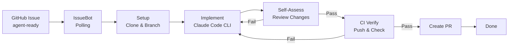

# IssueBot


An autonomous dev agent that watches GitHub repositories for issues labeled `agent-ready`, implements them using Claude Code CLI, and delivers pull requests.

## About

IssueBot is a locally-running, Spring AI-powered agent that automates software development tasks. It monitors your configured GitHub repositories, picks up labeled issues, and drives them through a structured implementation loop: plan, implement, self-assess, verify CI, and create a pull request. Each issue goes through up to N iterations (configurable) with built-in guardrails, cooldown logic, and human escalation when needed.



## Key Features

- **Autonomous Issue Resolution** - Detects `agent-ready` issues, implements changes, and opens PRs without human intervention
- **5-Phase Workflow** - Structured pipeline: Setup, Implementation, Self-Assessment, CI Verification, Completion
- **Self-Assessment Loop** - Separate Claude Code session reviews changes against requirements before pushing
- **CI-Aware** - Pushes branches, polls GitHub Checks API, and feeds failure logs back into the next iteration
- **Iteration Guardrails** - Configurable max iterations per repo, automatic cooldown, and `needs-human` escalation
- **Dual Mode** - Fully autonomous or approval-gated (draft PRs with human review)
- **Spring AI Tool Integration** - All external capabilities (GitHub, Git, Claude Code, CI, notifications) exposed as Spring AI tools
- **Cost Tracking** - Per-iteration token usage and estimated cost recorded in the database
- **Desktop Notifications** - OS-level notifications via SystemTray with graceful fallback
- **Local-First** - Runs on your machine with an embedded H2 database; no external infrastructure required

## Built With

- [Spring Boot 3.4.2](https://spring.io/projects/spring-boot) - Application framework
- [Spring AI 1.1.2](https://docs.spring.io/spring-ai/reference/) - AI/LLM integration with Anthropic
- [Claude Code CLI](https://docs.anthropic.com/en/docs/claude-code) - Headless code generation
- [JGit 7.1.0](https://www.eclipse.org/jgit/) - Git operations in Java
- [H2 Database](https://www.h2database.com/) - Embedded SQL database
- [Flyway](https://flywaydb.org/) - Database migrations
- [Thymeleaf](https://www.thymeleaf.org/) - Server-side templates (dashboard, Phase 3)

## Getting Started

### Prerequisites

- **Java 21+** - [Download](https://adoptium.net/)
- **Claude Code CLI** - [Install guide](https://docs.anthropic.com/en/docs/claude-code)
- **GitHub Personal Access Token** - With `repo` scope for the repositories you want IssueBot to manage
- **Anthropic API Key** - For the Spring AI orchestration agent

### Installation

1. Clone the repository

```bash
git clone https://github.com/dbbaskette/IssueBot.git
cd IssueBot
```

2. Set environment variables

```bash
export GITHUB_TOKEN=ghp_your_token_here
export ANTHROPIC_API_KEY=sk-ant-your_key_here
```

3. Build the project

```bash
./mvnw clean package -DskipTests
```

4. Run IssueBot

```bash
./mvnw spring-boot:run
```

IssueBot starts on port **8090**. Verify with:

```bash
curl http://localhost:8090/actuator/health
```

## Usage

### Configuration

On first run, IssueBot creates `~/.issuebot/config.yml`. Edit it to add your repositories:

```yaml
issuebot:
  poll-interval-seconds: 60
  max-concurrent-issues: 3

  claude-code:
    max-turns-per-invocation: 30
    model: claude-sonnet-4-5-20250929
    timeout-minutes: 10

  github:
    token: ${GITHUB_TOKEN}

  repositories:
    - owner: my-org
      name: my-app
      branch: main
      mode: autonomous        # or 'approval-gated'
      max-iterations: 5
      ci-timeout-minutes: 15
      allowed-paths:
        - src/
        - test/
```

### How It Works

1. **Label an issue** `agent-ready` on any watched repository
2. **IssueBot detects it** on the next poll cycle (default: 60s)
3. **Clones the repo**, creates a branch `issuebot/issue-{number}-{slug}`
4. **Invokes Claude Code CLI** with a structured prompt based on the issue
5. **Self-assesses** the changes in a separate session
6. **Pushes and waits for CI** to pass
7. **Creates a pull request** (or draft PR in approval-gated mode)

If self-assessment or CI fails, IssueBot loops back with enhanced context (previous diff, failure logs) and tries again up to the configured max iterations.

### Modes

| Mode | Behavior |
|------|----------|
| `autonomous` | Creates PR directly, comments on issue, removes `agent-ready` label |
| `approval-gated` | Creates draft PR, sends notification, waits for human approval |

### Endpoints

| Endpoint | Description |
|----------|-------------|
| `GET /actuator/health` | Health check |
| `GET /actuator/metrics` | Application metrics |
| `GET /h2-console` | H2 database console (dev) |

## Environment Variables

| Variable | Required | Description |
|----------|----------|-------------|
| `GITHUB_TOKEN` | Yes | GitHub PAT with `repo` scope |
| `ANTHROPIC_API_KEY` | Yes | Anthropic API key for Spring AI orchestration |

## Project Structure

```
src/main/java/com/dbbaskette/issuebot/
├── config/              # Configuration properties, async, WebClient
├── model/               # JPA entities (WatchedRepo, TrackedIssue, Iteration, Event, CostTracking)
├── repository/          # Spring Data JPA repositories
├── service/
│   ├── claude/          # Claude Code CLI wrapper and stream-json parser
│   ├── event/           # Event logging service
│   ├── git/             # JGit operations (clone, branch, diff, push)
│   ├── github/          # GitHub API client (issues, PRs, CI checks)
│   ├── notification/    # Desktop and dashboard notifications
│   ├── orchestration/   # Spring AI ChatClient orchestration agent
│   ├── polling/         # Scheduled issue detection and qualification
│   ├── tool/            # Spring AI tool definitions (7 tool classes)
│   └── workflow/        # 5-phase workflow engine and iteration manager
├── validation/          # Startup validation (CLI, auth, token checks)
└── IssueBotApplication.java
```

## Roadmap

- [x] **Phase 1: Foundation** - Spring Boot scaffolding, database, config, GitHub/Git/Claude services
- [x] **Phase 2: Core Agent Loop** - MCP tools, polling, orchestration, 5-phase workflow, iteration guardrails
- [ ] **Phase 3: User Interface** - Thymeleaf + HTMX dashboard, issue queue, approval workflow UI
- [ ] **Phase 4: Polish & Hardening** - Observability, error handling, cost reporting, integration tests

## Contributing

Contributions are welcome! Please open an issue to discuss proposed changes before submitting a pull request.

1. Fork the repository
2. Create a feature branch (`git checkout -b feature/my-feature`)
3. Commit your changes (`git commit -m 'Add my feature'`)
4. Push to the branch (`git push origin feature/my-feature`)
5. Open a Pull Request

## License

Distributed under the MIT License. See [LICENSE](LICENSE) for details.

## Contact

Dan Baskette - [GitHub](https://github.com/dbbaskette)

Project Link: [https://github.com/dbbaskette/IssueBot](https://github.com/dbbaskette/IssueBot)
