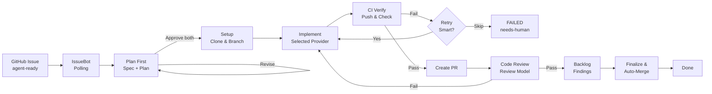
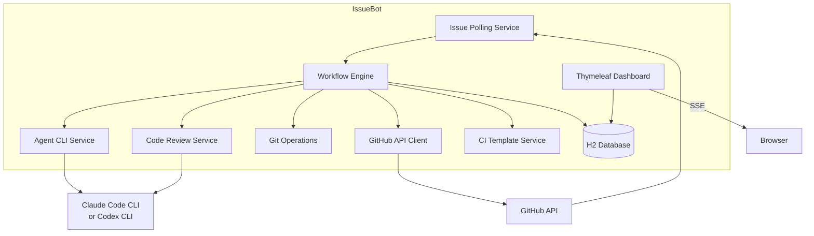

# IssueBot


An autonomous dev agent that watches GitHub repositories for issues labeled `agent-ready`, implements them with Claude Code CLI or Codex CLI, runs an independent code review with a separate model, and delivers pull requests.

## Why It Exists

Filing a good issue is the easy part; the work between a well-specified issue and a merged pull request is not — it's the context-loading, editing, CI-waiting, and self-review that rarely fits in the gaps of a working day. IssueBot treats that entire stretch as a single autonomous loop: label an issue `agent-ready` and it clones the repo, implements the change, pushes and watches CI, opens a PR, and sets a second, independent model against its own work before anything merges. The design rests on three ideas — **separate the builder from the reviewer**, so the code that ships has already survived an adversarial read; **keep a human on the gates that matter** (plan approval, PR review, merge) rather than in the keystroke-by-keystroke loop; and **run entirely on your machine**, so your source and your API tokens never leave it. It's meant to be pointed at real repositories and left to work.

## How It Works

IssueBot is a locally-running agent that automates software development tasks end-to-end. It monitors your configured GitHub repositories, picks up labeled issues, and drives them through a structured 6-phase workflow with dual-model architecture: one model implements the code, a separate model reviews it independently. The execution provider is configurable as either Claude Code CLI or Codex CLI, and each role's model is configurable from the dashboard at the global, per-repo, and per-issue level. Defaults are provider-specific: Claude Code uses Opus 4.8 for implementation and Sonnet 5 for review; Codex CLI uses `gpt-5.6-sol` for implementation and `gpt-5.6-terra` for review.


```mermaid
flowchart LR
    A[GitHub Issue<br>agent-ready] --> B[IssueBot<br>Polling]
    B --> P[Plan First<br>Spec + Plan]
    P -->|Revise| P
    P -->|Approve both| C[Setup<br>Clone & Branch]
    C --> D[Implement<br>Selected Provider]
    D --> E[CI Verify<br>Push & Check]
    E -->|Fail| F{Retry<br>Smart?}
    F -->|Skip| G[FAILED<br>needs-human]
    F -->|Yes| D
    E -->|Pass| H[Create PR]
    H --> I[Code Review<br>Review Model]
    I -->|Fail| D
    I -->|Pass| J[Backlog<br>Findings]
    J --> K[Finalize &<br>Auto-Merge]
    K --> L[Done]
```

### The 6-Phase Pipeline

| Phase | What Happens | Model |
|-------|-------------|-------|
| **1. Setup** | Clone repo, create feature branch, generate CI workflow if needed | - |
| **2. Implementation** | Selected agent CLI writes code based on issue spec | Implementation model (provider-specific default) |
| **3. CI Verification** | Commit, push, poll GitHub Actions for compile + test | - |
| **4. PR Creation** | Create pull request on GitHub (draft for approval-gated repos) | - |
| **5. Independent Review** | Separate model reviews code against spec, posts PR review comments | Review model (provider-specific default) |
| **6. Completion** | Post review to PR, route non-blocking review findings per repo setting (default: deduplicated rolling backlog issue), auto-merge if configured | - |

If CI or review fails, IssueBot evaluates whether a retry is worthwhile (timeout? excessive tokens? no progress?) before looping back to implementation with enhanced context. Default max: **2 iterations**. Failed issues require **manual retry** from the dashboard.

### Plan First approval contract

Plan First is enabled by default for every repository and can be explicitly disabled for a repository or overridden for an individual issue when it is started or retried. Before IssueBot can create a feature branch or modify code, the implementation model produces one structured planning version containing both a **Design Spec** and an **Implementation Plan**. The issue page presents those artifacts in separate tabs, with a third **History** tab for every immutable numbered version.

Revision guidance creates a new version and supersedes the prior pending version without deleting or editing it. One approval action approves the selected current version's Design Spec and Implementation Plan together; that exact version is then pinned as the implementation and independent-review contract.

Plan First review uses a fixed two-attempt conformance cycle. The first miss automatically schedules one corrective implementation using the review findings. A second miss stops in Needs Guidance. An operator can then retry with implementation guidance, which starts a fresh two-attempt cycle against the same approved version—the guidance does not revise the spec, plan, or version history.

## Key Features

- **Dual-Provider CLI Support** - Choose Claude Code CLI with a Claude subscription login or Codex CLI with a ChatGPT subscription login from Settings; model choices update for the selected provider
- **Dual-Model Architecture** - Implementation and review use independently configurable models, settable at the global, per-repo, and per-issue level for checks and balances
- **6-Phase Workflow** - Setup, Implementation, CI Verification, PR Creation, Independent Review, Completion
- **Independent Code Review** - The configured review model evaluates 7 dimensions: spec compliance, correctness, code quality, test coverage, architecture fit, regressions, and security
- **Review Feedback Loop** - Failed review findings are fed back to the implementation model with specific file/line references for targeted fixes
- **Noise-Controlled Findings** - Non-blocking review findings are routed per the per-repo `follow-up-mode` setting: `ROLLING_BACKLOG` (default) dedupes findings into a single per-repo backlog issue capped at 50 items, `COMMENT_ONLY` posts a summary comment on the original issue instead of opening a new one, `PER_ISSUE` is the legacy one-follow-up-issue-per-completed-issue behavior, and `OFF` keeps findings in the PR review comment only
- **Approval-Gated Issue Splitting** - When an issue is too large, IssueBot proposes a sub-issue breakdown and waits for you to approve or reject it from the dashboard (`PROPOSE`, the default); `AUTO` creates sub-issues immediately and `OFF` disables splitting, all per repo. One split level only (sub-issues are never re-split further), capped at 10 open sub-issues per repo, and the parent stays open as a tracking issue that auto-closes once all sub-issues are closed
- **Versioned Plan First** (default on) - Generates separate Design Spec and Implementation Plan artifacts before code changes, keeps immutable version history, and requires one approval for both artifacts. The approved version governs implementation and independent review; one automatic correction is allowed before the issue stops for guidance, and a guided retry preserves the approved version. Repositories and individual issues can explicitly opt out when this approval contract is not appropriate
- **Smart Retry Intelligence** - Evaluates failure context (timeout, excessive tokens, no progress) before retrying to avoid burning tokens on hopeless attempts
- **Manual Retry with Instructions** - Failed issues require manual retry from the dashboard with an optional text box for additional human guidance
- **Cancel Running Issues** - A Stop button on the issue-detail page stops the running agent process at the next workflow checkpoint
- **Pause All Processing** - A persisted global control stops active workflows at safe checkpoints and prevents future automatic starts, manual starts, and retries until processing is resumed
- **Manual Start for Pending Work** - Pending or queued issues can be started directly from the queue or issue page while preserving repository and open-PR safety gates
- **Durable Ordered Decomposition** - A split parent reserves its repository while IssueBot creates and runs child issues in order, survives restarts and partial GitHub failures, and closes the parent only after every child completes
- **Actionable Failure Recovery** - Failed issues show a sanitized summary, suggested next step, optional technical details, and a guidance field for the retry
- **Mid-Loop Guidance** - Steer a running issue from the dashboard; guidance is injected at the next iteration boundary
- **CI-Aware** - Pushes branches, polls GitHub Checks API, and feeds failure logs back into the next iteration
- **Security Review** - Optional OWASP-focused security analysis per repository (injection, auth, data exposure, access control)
- **Iteration Guardrails** - Separate budgets for implementation iterations (default: 2) and review iterations, `needs-human` escalation when retries are exhausted
- **Issue Dependency Resolution** - Uses GitHub's native issue dependencies (`blockedBy` relationships) with body-text fallback, processes issues in topological order
- **CI Template Generation** - Auto-generates GitHub Actions workflows (Maven, Gradle, Node, Go) for repos without CI
- **Dual Mode** - Fully autonomous (auto-merge) or approval-gated (draft PRs with human review)
- **Honest Approvals** - Approving an issue can optionally squash-merge its PR directly from the dashboard, with inline CI status shown before you approve
- **Dashboard Authentication** - Optional username/password login via environment variables
- **Web Dashboard** - Liquid-glass UI with a light/dark theme toggle, real-time monitoring (live terminal streaming with scroll-lock/copy, phase pipeline, iteration history with colorized diffs, review scores), drill-through metric tiles, and keyboard-accessible navigation — mobile-responsive with hamburger menu
- **Cost Tracking** - Per-phase token usage with separate implementation vs review cost breakdowns, a per-repo cost chart, and sortable cost tables
- **Local-First** - Runs on your machine with an embedded H2 database; no external infrastructure required
- **Custom Instructions** - Free-text per-repo guidance ("use constructor injection", "never touch /legacy") injected into every implementation prompt and surfaced as reviewer context in the independent code review
- **Cross-Issue Lessons** (opt-in) - When enabled, a cheap utility-model call distills 1-3 transferable lessons from each completed (or exhausted) issue and injects them into future implementation prompts for the same repo; capped at 30 lessons (oldest evicted first), with per-lesson delete from the dashboard

## Built With

- [Spring Boot 3.4.2](https://spring.io/projects/spring-boot) - Application framework
- [Claude Code CLI](https://docs.anthropic.com/en/docs/claude-code) - Claude subscription-backed headless code generation and review
- Codex CLI - ChatGPT subscription-backed headless code generation and review
- [JGit 7.1.0](https://www.eclipse.org/jgit/) - Git operations in Java
- [Thymeleaf](https://www.thymeleaf.org/) + [HTMX](https://htmx.org/) - Dashboard with SSE live updates
- [H2 Database](https://www.h2database.com/) - Embedded SQL database
- [Flyway](https://flywaydb.org/) - Database migrations

## Getting Started

### Prerequisites

- **Java 21+** - [Download](https://adoptium.net/)
- **At least one agent CLI**:
  - **Claude Code CLI** - [Install guide](https://docs.anthropic.com/en/docs/claude-code) (log in via `claude` before first use)
  - **Codex CLI** - Install Codex CLI, make sure `codex` is on the shell `PATH` used to start IssueBot, then run `codex login` and choose ChatGPT login. If you use the bundled ChatGPT app binary directly, the path is typically `/Applications/ChatGPT.app/Contents/Resources/codex`.
- **GitHub Personal Access Token** - With `repo` scope for the repositories you want IssueBot to manage

### Installation

1. Clone the repository

```bash
git clone https://github.com/dbbaskette/IssueBot.git
cd IssueBot
```

2. Add your GitHub token to `.env`

```bash
cp .env.example .env
# Edit .env and set GITHUB_TOKEN=ghp_your_token_here
```

3. Run IssueBot

```bash
./run.sh
```

This builds the project, kills any existing instance, and starts IssueBot on port **8090**.

For the hardened two-service Docker topology and operator procedures, see the [Docker deployment runbook](docs/deployment.md). `codex-cli-provider` is built, released, authenticated, and credentialed by its independent project; IssueBot only consumes a compatible image pinned by immutable digest. **Production cutover remains forbidden until that image exists and IssueBot integration has removed direct local `claude` execution.**

Alternatively, build and run manually:

```bash
./mvnw clean package -DskipTests
java -jar target/issuebot-0.1.0-SNAPSHOT.jar
```

4. Open the dashboard at [http://localhost:8090](http://localhost:8090)

### Fresh Start

To wipe the database and all cloned repos:

```bash
./run.sh --cleanup
```

## Usage

### Quick Start

1. Open the dashboard at `http://localhost:8090`
2. Navigate to **Repositories** and add a GitHub repository
3. Label a GitHub issue with `agent-ready`
4. IssueBot proposes a Design Spec and Implementation Plan on the next poll cycle (default: 60s)
5. Review or revise the version, then approve both artifacts once to start implementation

### Configuration

IssueBot can be configured via the dashboard UI or by editing `~/.issuebot/config.yml`:

```yaml
issuebot:
  agent-provider: claude-code # claude-code or codex
  poll-interval-seconds: 60
  max-concurrent-issues: 3

  claude-code:
    implementation-model: claude-opus-4-8
    review-model: claude-sonnet-5
    utility-model: claude-haiku-4-5
    max-turns-per-invocation: 30
    timeout-minutes: 45          # implementation/planning wall-clock cap
    review-max-turns: 15
    review-timeout-minutes: 20   # review/utility cap (only reads a diff, so smaller)

  codex-cli:
    implementation-model: gpt-5.6-sol
    review-model: gpt-5.6-terra
    utility-model: gpt-5.6-luna
    timeout-minutes: 45
    review-timeout-minutes: 20

  github:
    token: ${GITHUB_TOKEN}

  repositories:
    - owner: my-org
      name: my-app
      branch: main
      mode: autonomous
      max-iterations: 2
      max-review-iterations: 2
      security-review-enabled: false
      ci-enabled: true
      ci-timeout-minutes: 15
      auto-merge: false
      follow-up-mode: ROLLING_BACKLOG
      decomposition-mode: PROPOSE
      plan-first: true
      pre-screen-enabled: true
      # implementation-model: claude-opus-4-8   # optional per-repo override; omit to inherit selected provider default
      # review-model: claude-sonnet-5           # optional per-repo override; omit to inherit selected provider default
      allowed-paths:
        - src/
        - test/
```

### Autonomy Presets

Autonomy is spread across six settings (mode, auto-start, auto-merge, decomposition mode, follow-up mode, plan-first) — configuring a new repo from scratch means understanding all of them. The dashboard's repo add/edit form offers an **Autonomy preset** selector at the top instead: **Observe**, **Assist** (default), or **Autonomous**. Picking a preset fills in the six settings below it (which live in a collapsible "Advanced settings" section); editing any of them afterward flips the selector to **Custom**. This is pure UI sugar — nothing new is persisted, and `config.yml` still only has the six underlying settings.

| Setting | Observe | Assist | Autonomous |
|---------|---------|--------|------------|
| `mode` | `approval-gated` | `approval-gated` | `autonomous` |
| `auto-start` | off | on | on |
| `auto-merge` | off | off | on |
| `decomposition-mode` | `PROPOSE` | `PROPOSE` | `AUTO` |
| `follow-up-mode` | `COMMENT_ONLY` | `ROLLING_BACKLOG` | `ROLLING_BACKLOG` |
| `plan-first` | on | on | on |

### Repository Settings

| Setting | Default | Description |
|---------|---------|-------------|
| `mode` | `autonomous` | `autonomous` (auto-merge) or `approval-gated` (draft PR, human review) |
| `max-iterations` | `2` | Max implementation attempts before escalating |
| `max-review-iterations` | `2` | Max review cycles before escalating |
| `security-review-enabled` | `false` | Enable OWASP security analysis in code review |
| `ci-enabled` | `true` | Push and poll GitHub Actions after implementation |
| `ci-timeout-minutes` | `15` | How long to wait for CI checks |
| `auto-merge` | `false` | Auto-merge PRs via squash after review passes |
| `follow-up-mode` | `ROLLING_BACKLOG` | How non-blocking review findings are captured: `ROLLING_BACKLOG` (deduped per-repo backlog issue, capped at 50 items), `COMMENT_ONLY` (summary comment on the original issue), `PER_ISSUE` (legacy: one follow-up issue per completed issue), or `OFF` (PR review comment only) |
| `decomposition-mode` | `PROPOSE` | How oversized issues are split: `PROPOSE` (bot proposes, you approve from the dashboard), `AUTO` (legacy: splits immediately), or `OFF` (never split, escalate instead) |
| `plan-first` | `true` | Require a versioned Design Spec and Implementation Plan with one approval before implementation. Disable at repository level, or use the per-issue start/retry override, to opt out explicitly |
| `pre-screen-enabled` | `true` | Run a cheap utility-model pass before implementation to catch oversized issues early |
| `implementation-model` | inherit global | Per-repo override of the implementation model |
| `review-model` | inherit global | Per-repo override of the review model |
| `custom-instructions` | (none) | Free-text standing guidance injected into every implementation prompt (`## Repository Instructions`) and into the review prompt as reviewer context ("the repo owner requires...") |
| `lessons-enabled` | `false` | When on, a completed (or iteration-exhausted) issue triggers a cheap utility-model call that distills 1-3 transferable lessons, stored per-repo (capped at 30, oldest evicted first) and injected into future implementation prompts (`## Lessons from previous issues in this repo`). Curate/delete lessons from the repo row on the dashboard |

### Issue Dependencies

IssueBot respects dependency chains. There are two ways to declare blockers:

**1. GitHub native dependencies (recommended)** — Use GitHub's built-in "Mark as blocked by" feature on the issue sidebar. IssueBot reads these via the GraphQL API.

**2. Body text (legacy fallback)** — Add this line to an issue body:

```
**Blocked by:** #5, #12
```

Either way, IssueBot will wait until the blocking issues are completed before processing the blocked issue. Native GitHub dependencies are checked first; body text is used as a fallback.

### Dashboard

The web dashboard at `http://localhost:8090` provides:

- **Dashboard** - Overview metrics: active issues, completion rate, total cost
- **Issues** - Queue with status filters, click into any issue for detail view
- **Issue Detail** - Live terminal streaming, phase pipeline, iteration history with diffs, review scores
- **Repositories** - Add/configure repos with review and CI settings
- **Costs** - Per-issue and per-repo cost breakdowns

### Endpoints

| Endpoint | Description |
|----------|-------------|
| `http://localhost:8090` | Web dashboard |
| `POST /webhooks/github` | GitHub webhook receiver (instant issue pickup — see below) |
| `GET /actuator/health` | Health check |
| `GET /actuator/metrics` | Application metrics |
| `GET /h2-console` | H2 database console |

### GitHub Webhooks (instant pickup)

Polling checks for `agent-ready` issues every `poll-interval-seconds` (default 60s). Webhooks make pickup near-instant — a `labeled` event for `agent-ready` on a watched repo is evaluated immediately, and a `closed` event opportunistically re-checks blocked issues and parent trackers for that repo. Polling keeps running unchanged as the fallback/reconciliation loop, so nothing breaks if a delivery is missed; once webhooks are working reliably you can raise `poll-interval-seconds` to reduce API calls.

1. Set the `ISSUEBOT_WEBHOOK_SECRET` environment variable to a random string (e.g. `openssl rand -hex 32`) and restart IssueBot. The endpoint returns `503` while this is unset — webhooks are fully opt-in.
2. On each watched GitHub repo: **Settings → Webhooks → Add webhook**.
   - Payload URL: `http://<your-host>:8090/webhooks/github`
   - Content type: `application/json`
   - Secret: the same value as `ISSUEBOT_WEBHOOK_SECRET`
   - Events: select **Issues** only
3. The [Setup page](http://localhost:8090/setup) shows whether the secret is configured and a per-repo "last webhook event" timestamp, so you can confirm deliveries are actually arriving.

**Local-first deployments** (no public URL) need a tunnel so GitHub can reach `localhost`. [smee.io](https://smee.io) is the simplest option:

```bash
npm install -g smee-client
smee -u https://smee.io/YOUR_CHANNEL -t http://localhost:8090/webhooks/github
```

Use the smee channel URL (`https://smee.io/YOUR_CHANNEL`) as the GitHub webhook's payload URL instead of `localhost`; the `smee` client forwards deliveries to your local instance. Cloudflare Tunnel (`cloudflared tunnel --url http://localhost:8090`) or Tailscale Funnel work the same way if you'd rather not depend on smee.io.

## Environment Variables

| Variable | Required | Description |
|----------|----------|-------------|
| `GITHUB_TOKEN` | Yes | GitHub PAT with `repo` scope |
| `ISSUEBOT_USERNAME` | No | Dashboard login username (auth disabled if unset) |
| `ISSUEBOT_PASSWORD` | No | Dashboard login password (auth disabled if unset) |
| `ISSUEBOT_WEBHOOK_SECRET` | No | HMAC secret for `POST /webhooks/github` (webhook receiver disabled/503 if unset) |

## Architecture


```mermaid
flowchart TB
    subgraph IssueBot
        Polling[Issue Polling Service]
        Workflow[Workflow Engine]
        Agent[Agent CLI Service]
        Review[Code Review Service]
        GitOps[Git Operations]
        GitHub[GitHub API Client]
        CI[CI Template Service]
        DB[(H2 Database)]
        Dashboard[Thymeleaf Dashboard]
    end

    GH[GitHub API] --> Polling
    Polling --> Workflow
    Workflow --> Agent
    Workflow --> Review
    Workflow --> GitOps
    Workflow --> GitHub
    Workflow --> CI
    Agent --> CLI[Claude Code CLI<br>or Codex CLI]
    Review --> CLI
    GitHub --> GH
    Workflow --> DB
    Dashboard --> DB
    Dashboard -->|SSE| Browser[Browser]
```

## Project Structure

```
src/main/java/com/dbbaskette/issuebot/
├── config/              # Configuration properties, async, WebClient, HTMX
├── controller/          # Dashboard controllers (issues, repos, costs, approvals)
├── model/               # JPA entities (WatchedRepo, TrackedIssue, Iteration, Event, CostTracking)
├── repository/          # Spring Data JPA repositories
├── security/            # Security configuration, branch validation, log sanitization
├── observability/       # Health indicators and Micrometer metrics
├── service/
│   ├── ci/             # CI workflow template generation (Maven, Gradle, Node, Go)
│   ├── claude/         # Agent CLI facade, Claude Code execution, stream-json parser
│   ├── codex/          # Codex CLI execution, auth checks, model discovery
│   ├── dependency/     # Issue dependency resolution (GitHub native + body-text fallback)
│   ├── event/          # Event logging and SSE broadcasting
│   ├── git/            # JGit operations (clone, branch, diff, commit, push)
│   ├── github/         # GitHub API client (issues, PRs, CI checks, PR reviews)
│   ├── notification/   # Desktop and dashboard notifications
│   ├── orchestration/  # Spring AI ChatClient orchestration agent
│   ├── polling/        # Scheduled issue detection and qualification
│   ├── review/         # Independent code review (prompt builder, result parser)
│   ├── tool/           # Spring AI tool definitions
│   └── workflow/       # 6-phase workflow engine and iteration manager
├── validation/          # Startup validation (CLI, auth, token checks)
└── IssueBotApplication.java

src/main/resources/
├── db/migration/        # Flyway migrations (V1-V8)
├── static/css/          # Dashboard styles
├── templates/           # Thymeleaf templates (dashboard, issues, repos, costs)
└── application.yml      # Default configuration
```

## Contributing

Contributions are welcome! Please open an issue to discuss proposed changes before submitting a pull request.

1. Fork the repository
2. Create a feature branch (`git checkout -b feature/my-feature`)
3. Commit your changes (`git commit -m 'Add my feature'`)
4. Push to the branch (`git push origin feature/my-feature`)
5. Open a Pull Request

## License

Distributed under the MIT License. See [LICENSE](LICENSE) for details.

## Contact

Dan Baskette - [GitHub](https://github.com/dbbaskette)

Project Link: [https://github.com/dbbaskette/IssueBot](https://github.com/dbbaskette/IssueBot)
