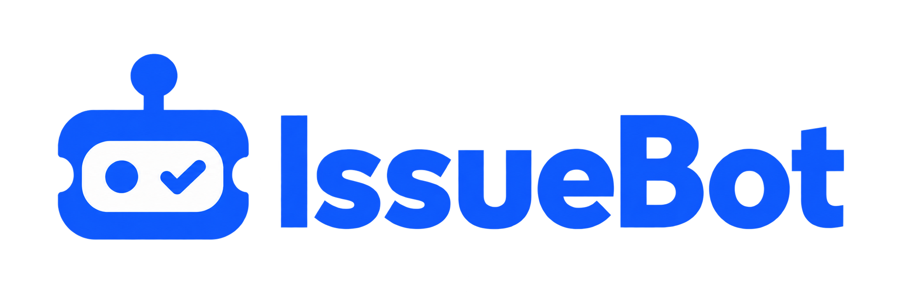

  

# Less tending the backlog. More shipping.

**IssueBot turns well-defined GitHub tasks into reviewed pull requests—with you in control.**

Give it a task, choose your coding assistant, and follow the work from one dashboard.
Your assistant plans, implements, tests, and refines the change. A different model reviews
the result before it moves toward merge. You decide where to step in.

[Get started](#get-started) · [Try your first task](#try-your-first-task) · [Explore the guides](#go-further)

## A coding assistant with a workflow around it

- **Choose your assistant.** Use Codex CLI or Claude Code with your existing subscription login. Pick the implementation and review models in Settings.
- **See the plan before the code.** Start with a design and implementation plan, add feedback, and keep earlier versions within reach.
- **Get a second opinion.** An independent model reviews the change. See scores, findings, and progress without hunting through GitHub comments.
- **Stay in control.** Choose approval checkpoints or an automated workflow. Hold queued work, start a task yourself, or pause processing.
- **Keep the conversation in one place.** Answer assistant questions, respond to permission requests, and give guidance from the task page.
- **Run it where you work.** Your dashboard, checkouts, and workflow history live on your machine or server. No separate database service is needed.

IssueBot connects to GitHub and your selected AI provider to do the work; local hosting does
not mean model processing happens offline. Workflow guidance is included—no separate
Superpowers installation is required.

## From task to reviewed change

**Describe → Plan → Implement and test → Independent review → Approve or merge**

The coding assistant owns the implement–test–fix loop. Review findings go back to it for
focused corrections. Your repository settings determine which steps need your approval
and whether a reviewed pull request can merge automatically.

Start hands-on. Automate more as you get comfortable.

## Get started

### 1. Have these ready

- **Java 21 or newer** and Git. The repository includes a Maven wrapper for the build.
- **[Codex CLI](https://github.com/openai/codex) or [Claude Code](https://code.claude.com/docs/en/overview)**, installed on the `PATH` used to start IssueBot and signed in:

  - Codex: run `codex login` and choose ChatGPT login.
  - Claude Code: run `claude` and complete its subscription sign-in.
- **A GitHub personal access token** with access to the repositories you want to manage. It needs permission to read tasks and create branches, commits, and pull requests; classic tokens use the `repo` scope.

Your agent's subscription limits still apply. IssueBot uses subscription login rather than
requiring an AI API key.

### 2. Download and configure

~~~bash
git clone https://github.com/dbbaskette/IssueBot.git
cd IssueBot
cp .env.example .env
~~~

Open `.env` and set:

| Setting | What to enter |
| --- | --- |
| `GITHUB_TOKEN` | Your GitHub token |
| `ISSUEBOT_USERNAME` | A dashboard username |
| `ISSUEBOT_PASSWORD` | A strong password—replace the example value |

Keep `.env` private; it is excluded from Git. Dashboard login protects your controls and is
required to change assistant permissions or answer permission requests.

### 3. Build and launch

From the repository directory:

~~~bash
./mvnw package -DskipTests
set -a
. ./.env
set +a
java -jar target/issuebot.jar
~~~

Open **[localhost:8090](http://localhost:8090)** and sign in.

Visit **Setup** to check your GitHub connection and assistant login. Then open **Settings**
to choose Codex or Claude Code and your models. Choose different models for implementation
and independent review.

## Try your first task

Start with a small change in a repository you're comfortable experimenting with—for example,
improving a validation message and adding a regression test.

1. **Add the repository** from Repositories.
2. **Keep the first run hands-on:** use Plan First, approval checkpoints, manual start, and manual merge.
3. **Write a clear GitHub task** with the desired behavior and a short acceptance checklist. Add the `agent-ready` label to make it eligible for pickup.
4. **Open the task in IssueBot.** Use the current-action panel to review the plan, give feedback, and start work when you're ready.
5. **Follow the result.** Watch progress, inspect the review, and approve the pull request when you're satisfied.

**Needs You** brings decisions together. You can also act directly on the task page.
Automatic start and automatic merge are separate choices, so you can enable one without
giving up control of the other.

### Make it yours

Add standing instructions for each repository, choose your models and approval checkpoints,
and decide how much autonomy to give the assistant. Start with **Ask for approval**;
**Approve for me** uses the harness's native permission review. **Full access** is an explicit
opt-in for environments you trust.

## Go further

- [Workflow and operator controls](docs/operator-workflow.md)—planning, approvals, testing, and recovery.
- [Assistant capabilities](docs/harness-capabilities.md)—what Codex and Claude Code can do and how permissions work.
- [Included workflow guidance](docs/managed-skills.md)—the maintained guidance that travels with IssueBot.
- [Run as a macOS service](docs/macos-home-server.md)—keep IssueBot available on a host you manage.
- [Release notes](CHANGELOG.md)—see what's new.

For your first installation, use the native launch above. Read the deployment guides before
moving to a persistent or externally accessible service.

## Build with us

Have an idea that would make your development day easier? Feedback, documentation improvements,
and pull requests are welcome. Try IssueBot on a small task and tell us what would make the
next one smoother.

Built with Java, Spring Boot, Thymeleaf, and HTMX. Distributed under the [MIT License](LICENSE).
